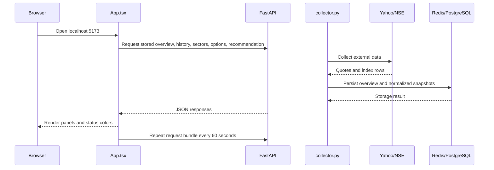

# MarketPulse Workflow

## 1. Purpose and Current Scope

MarketPulse is a Dockerized React and FastAPI application for Indian-market analysis.
The current application combines:

- Global exchange and macro context
- Indian index and market breadth data
- Indian sector intelligence
- Options-chain analytics when the provider is available
- A rule-based recommendation output
- PostgreSQL signal history
- Redis latest-data buffering

This document describes the implementation as it exists today. It also calls out the
parts that are intentionally still planned, so a missing value is not mistaken for a
completed live data feature.

## 2. Architecture Picture

```mermaid
flowchart TD
    Browser[Safari or browser] --> Frontend[Vite React frontend\nlocalhost:5173]
        Frontend -->|GET stored overview, sectors, history, options, recommendation| API[FastAPI API\nlocalhost:8000]

        Collector[collector.py\n60-second worker] --> Market[market_data.py]
        Collector --> Sector[sectors.py]
        Collector --> Derivatives[derivatives.py]
        Collector --> Storage[storage.py]

        API --> Storage

    Market --> Yahoo[Yahoo Finance chart API]
    Market --> NSE[NSE India public APIs]
    Sector --> NSE
    Derivatives --> NSEOptions[NSE option-chain API]

    Storage --> Redis[(Redis\nlatest buffer and short list)]
    Storage --> Postgres[(PostgreSQL\nmarket_history JSONB)]

    Postgres --> History[/api/market/history]
    Redis --> Latest[latest payload buffer]

    API --> Response[JSON response with value, source, timestamp, freshness]
    Response --> Frontend
```

### Layer summary

| Layer | Responsibility |
| --- | --- |
| Browser | Requests data, renders panels, refreshes the dashboard every 60 seconds. |
| React/Vite | Presents market, sector, history, derivatives, and recommendation panels. |
| FastAPI | Defines HTTP routes, validates the overview response, and coordinates collectors. |
| Collectors | Call external providers and normalize values into application dictionaries. |
| Redis | Holds the latest overview for a short period and a bounded recent payload list. |
| PostgreSQL | Stores scored overview snapshots for historical signal analysis. |
| Docker Compose | Runs frontend, backend, Redis, PostgreSQL, and their network/volumes together. |

## 3. End-to-End Data Flow

1. The browser opens the React application on port `5173`.
2. `App.tsx` starts five requests:
   - `GET /api/market/overview`
   - `GET /api/market/history`
   - `GET /api/derivatives/options`
   - `GET /api/recommendation`
   - `GET /api/sectors`
3. The browser repeats this request bundle every 60 seconds.
4. The collector worker calls the market and sector collectors.
5. Market collectors call Yahoo Finance and NSE India.
6. The worker calls the options collector every fifth cycle, approximately every 5 minutes.
7. The worker calculates the recommendation from that cycle's overview and options result.
8. `storage.py` writes normalized records to PostgreSQL and latest results to Redis.
9. API routes read the latest stored result and return JSON without provider calls.
10. React uses the JSON fields to render values, source labels, freshness states, session
   states, tables, and recommendation output.

### Important timing detail

The independent collector worker is now present. `collector.py` runs continuously in
the `collector` Docker service and wakes every 60 seconds. It collects only when at
least one configured exchange session is active, then writes results to Redis and
PostgreSQL. The recommendation route reads the latest worker result instead of calling
external providers. This keeps all panels aligned to the same collection cycle.

### Agreed practical collection policy

The collector service uses different frequencies for different data costs:

| Frequency | Data collected |
| --- | --- |
| Every 1 minute during relevant sessions | NIFTY 50, BANK NIFTY, India VIX, global indexes, macro quotes, sector summaries, and recommendation inputs |
| Every 5 minutes during the options session | Options-chain summary: OI, change in OI, PCR, IV, max pain, support, and resistance |
| Every 15 minutes during the Indian session | Constituent prices, constituent breadth, and constituent technical metrics |
| Once per day | Sector/index constituent membership, weights, index metadata, and provider reference data |

The collector pauses or reduces collection outside the relevant exchange session,
weekends, and exchange holidays. A separate worker should write each completed cycle to
Redis and PostgreSQL. The API should read the latest stored result instead of recollecting
external providers for every browser request.

## 4. Backend Data Categories and Panels

### Market overview and primary panels

| Dashboard area | Code path | Sources | Main output |
| --- | --- | --- | --- |
| NASDAQ and Dow Jones | `market_data.py` -> Yahoo chart collector | Yahoo Finance symbols `^IXIC`, `^DJI` | Value, change, percentage, quote timestamp, source, freshness, session state |
| India VIX | `market_data.py` -> Yahoo chart collector | Yahoo Finance `^INDIAVIX` | Current value, change, percentage, timestamp, source, freshness |
| NIFTY 50 and BANK NIFTY | `market_data.py` -> Yahoo chart collector | Yahoo Finance `^NSEI`, `^NSEBANK` | Index value, change, percentage, timestamp, source, freshness |
| NSE breadth | `market_data.py` -> `breadth_from_nse` | NSE `allIndices` API | Advances, declines, unchanged, A/D ratio, timestamp, source |
| GIFT NIFTY | `market_data.py` -> `collect_gift_nifty` | Optional Yahoo symbol from `GIFT_NIFTY_YAHOO_SYMBOL` | Quote if configured; otherwise explicit unavailable state |
| Global exchange strip | `market_data.py` -> `collect_global_exchanges` | Yahoo Finance | S&P 500, NASDAQ, Dow, Shanghai, Hang Seng, Nikkei, ASX, DAX, Singapore, KOSPI, FTSE |
| Macro strip | `market_data.py` -> `collect_macro` | Yahoo Finance, NSE, environment config | Dollar Index, US 10Y yield, FII/DII flow, optional Fed funds rate |
| Indian sector panel | `sectors.py` -> `collect_sectors` | NSE `allIndices` API | 20 sector indexes, 1D change, relative strength versus NIFTY 50, score, classification, rotation buckets |
| Signal factors | `market_data.py` -> `collect_overview` | Normalized market results | Five current factors used by the overview score |

Every normalized quote carries the following concepts where applicable:

- `value`
- `change`
- `change_percent`
- `timestamp`
- `source`
- `freshness`: `live`, `stale`, or `unavailable`
- `market_state`: `active` or `offline` for known exchange sessions
- `market_state_reason`: for example `Weekend` or `Outside regular session`

An exchange can therefore be offline while still displaying its last known provider
quote. Offline means the market session is closed; unavailable means no usable quote
was received.

### Sector collector

`sectors.py` maps the 20-sector core universe to the names returned by NSE:

- Auto
- Bank
- Financial Services
- IT
- Pharma
- Healthcare
- FMCG
- Metal
- Realty
- PSU Bank
- Private Bank
- Oil & Gas
- Power
- Consumer Durables
- Capital Goods
- Cement
- Chemicals
- Media
- Telecommunications
- Construction

The current sector score is an intraday proxy based on:

- Trend proxy from 1D percentage change
- Momentum proxy from sector return relative to NIFTY 50
- Breadth score when the NSE row provides advances/declines
- A neutral fallback for unavailable components

Historical EMA/RSI/ROC/MACD, constituent breadth, velocity, ATR, long-horizon relative
strength, and NSE/BSE confirmation are not yet ingested. The API returns limitations
for these fields rather than presenting them as complete analytics.

### Derivatives and recommendation flow

`derivatives.py` requests the configured NSE option-chain URL. For the selected expiry it
calculates:

- Call open interest and put open interest
- Change in call OI and put OI
- Put-call ratio (PCR)
- ATM call/put implied volatility
- Max pain
- Highest-put-OI support level
- Highest-call-OI resistance level
- A simple bullish, bearish, or neutral derivatives signal

`/api/recommendation` combines the overview signal with the derivatives signal. It can
return a conditional setup only when the required options values are available. It is a
research output, not an automated trading or execution system.

## 5. Backend API Routes

| Method and route | Purpose |
| --- | --- |
| `GET /` | Basic application identity and version. |
| `GET /health` | Basic FastAPI health response. |
| `GET /health/storage` | Redis and PostgreSQL readiness check. |
| `GET /api/market/overview` | Reads the latest collector-produced overview from Redis or PostgreSQL. |
| `GET /api/market/history?limit=24` | Reads scored signal snapshots from PostgreSQL. |
| `GET /api/sectors` | Reads the latest collector-produced NSE sector universe and rotation summary. |
| `GET /api/derivatives/options?symbol=NIFTY` | Reads the latest stored options analytics or an explicit unavailable response. |
| `GET /api/recommendation?symbol=NIFTY` | Reads the latest stored market/derivatives bias and conditional setups. |

## 6. Storage Design

### Redis

Redis is used as a fast, short-lived buffer:

- Key `marketpulse:latest`: latest overview JSON, TTL 300 seconds.
- List `marketpulse:history`: recent overview payloads, trimmed to the latest 240 entries.

Redis is not the durable historical dataset. It is useful for fast latest-state access and
short recovery windows.

### PostgreSQL

At application startup, `storage.py` creates this table if it does not exist:

```sql
CREATE TABLE market_history (
    id BIGSERIAL PRIMARY KEY,
    observed_at TIMESTAMPTZ NOT NULL,
    signal TEXT NOT NULL,
    score INTEGER NOT NULL,
    confidence TEXT NOT NULL,
    overview JSONB NOT NULL
);
```

An index is created on `observed_at DESC`. The entire normalized overview is retained in
`overview`, while the signal, score, and confidence are duplicated as query-friendly
columns.

This is enough for the current signal timeline. A future historical market dataset
should normalize quote candles, sector metrics, constituents, and derivatives snapshots
into dedicated tables instead of placing all data in one JSONB document.

## 6A. Storage Catalog for the Collector Service

The collector service now initializes the PostgreSQL tables below and writes to the
listed Redis keys. `market_history` and the first two Redis keys existed before the
collector; the remaining objects were added for normalized collection storage.

### PostgreSQL objects currently present

| Object | Purpose | Current status |
| --- | --- | --- |
| `market_history` | Durable overview signal snapshots and the complete overview JSONB payload. | Exists now |
| `market_history_pkey` | Primary-key index on `market_history.id`. | Exists now |
| `market_history_observed_at_idx` | Descending time index for history queries. | Exists now |

### PostgreSQL tables used by the collector

| Table | Collection frequency | Retention/use |
| --- | --- | --- |
| `market_snapshots` | Every minute during relevant sessions | OHLCV and normalized quotes for indexes and macro instruments. |
| `sector_snapshots` | Every minute during the Indian session | Sector value, return, relative strength, score, and component metrics. |
| `options_snapshots` | Every 5 minutes during the options session | Compact options summary; full strike rows can be retained separately or sampled. |
| `recommendation_snapshots` | Every completed recommendation cycle | Auditable bias, score, setup, and source snapshot references. |
| `sector_constituents` | Daily or when index membership changes | Sector membership, exchange, symbol, and weight validity periods. |
| `constituent_snapshots` | Every 15 minutes during the Indian session | Constituent price, volume, return, and technical metrics. |
| `sector_rotation` | Every minute or every 5 minutes | Relative-strength/momentum quadrant and sector score over time. |

Suggested keys and relationships:

```text
market_snapshots:       (instrument, observed_at, source)
sector_snapshots:       (sector, observed_at, source)
options_snapshots:      (symbol, expiry, observed_at, source)
recommendation_snapshots: (observed_at, engine_version)
sector_constituents:    (sector, exchange, symbol, valid_from)
constituent_snapshots:  (symbol, observed_at, source)
sector_rotation:        (sector, observed_at)
```

The timestamp is part of every time-series key. This prevents a new collection from
overwriting an earlier observation and supports one-day, seven-day, and thirty-day
queries. A production migration should add these tables explicitly and use unique
constraints or upserts to make collector retries idempotent.

### PostgreSQL test queries and representative output

The following queries apply after the collector migration creates the planned tables.
The outputs are illustrative examples, not guaranteed current market values.

```sql
-- market_snapshots: latest NIFTY 50 quote
SELECT instrument, observed_at, close, change_percent, source
FROM market_snapshots
WHERE instrument = 'NIFTY 50'
ORDER BY observed_at DESC
LIMIT 1;
-- instrument | observed_at              | close    | change_percent | source
-- NIFTY 50   | 2026-08-23 10:14:00+00 | 24842.10 | 0.71           | NSE India

-- sector_snapshots: strongest sectors in the last day
SELECT sector, MAX(observed_at) AS latest_at, score, relative_strength
FROM sector_snapshots
WHERE observed_at >= NOW() - INTERVAL '1 day'
GROUP BY sector, score, relative_strength
ORDER BY score DESC
LIMIT 5;
-- sector | latest_at                | score | relative_strength
-- IT     | 2026-08-23 10:14:00+00 | 86    | 1.20

-- options_snapshots: PCR and OI changes for the latest expiry observation
SELECT symbol, expiry, observed_at, pcr, call_oi, put_oi,
       call_change_oi, put_change_oi, max_pain
FROM options_snapshots
ORDER BY observed_at DESC
LIMIT 1;
-- symbol | expiry       | observed_at              | pcr  | call_oi | put_oi | call_change_oi | put_change_oi | max_pain
-- NIFTY  | 28-Aug-2026  | 2026-08-23 10:10:00+00 | 1.08 | 1200000 | 1296000| 24000          | 51000         | 24900

-- recommendation_snapshots: recommendations generated during the last day
SELECT observed_at, bias, market_score, derivatives_signal, setups
FROM recommendation_snapshots
WHERE observed_at >= NOW() - INTERVAL '1 day'
ORDER BY observed_at DESC;
-- observed_at              | bias    | market_score | derivatives_signal | setups
-- 2026-08-23 10:14:00+00 | BULLISH | 83           | NEUTRAL            | []

-- sector_constituents: current constituents for one sector
SELECT sector, exchange, symbol, weight
FROM sector_constituents
WHERE sector = 'IT' AND valid_to IS NULL
ORDER BY weight DESC
LIMIT 5;
-- sector | exchange | symbol   | weight
-- IT     | NSE      | INFY     | 7.12

-- constituent_snapshots: latest constituent technical record
SELECT symbol, observed_at, price, change_percent, rsi, ema20, ema50, ema200
FROM constituent_snapshots
WHERE symbol = 'INFY'
ORDER BY observed_at DESC
LIMIT 1;
-- symbol | observed_at              | price  | change_percent | rsi  | ema20  | ema50  | ema200
-- INFY   | 2026-08-23 10:00:00+00 | 1780.4 | 1.10           | 64.2 | 1755.1 | 1710.3 | 1602.8

-- sector_rotation: latest quadrant assignment
SELECT sector, observed_at, relative_strength, momentum, quadrant, score
FROM sector_rotation
ORDER BY observed_at DESC, score DESC
LIMIT 5;
-- sector | observed_at              | relative_strength | momentum | quadrant | score
-- IT     | 2026-08-23 10:14:00+00 | 1.20              | 82       | LEADER   | 86
```

For a one-day row count by table:

```sql
SELECT 'market_snapshots' AS table_name, COUNT(*) FROM market_snapshots WHERE observed_at >= NOW() - INTERVAL '1 day'
UNION ALL SELECT 'sector_snapshots', COUNT(*) FROM sector_snapshots WHERE observed_at >= NOW() - INTERVAL '1 day'
UNION ALL SELECT 'options_snapshots', COUNT(*) FROM options_snapshots WHERE observed_at >= NOW() - INTERVAL '1 day'
UNION ALL SELECT 'recommendation_snapshots', COUNT(*) FROM recommendation_snapshots WHERE observed_at >= NOW() - INTERVAL '1 day'
UNION ALL SELECT 'constituent_snapshots', COUNT(*) FROM constituent_snapshots WHERE observed_at >= NOW() - INTERVAL '1 day'
UNION ALL SELECT 'sector_rotation', COUNT(*) FROM sector_rotation WHERE observed_at >= NOW() - INTERVAL '1 day';
```

Illustrative output for a full weekday collection:

```text
table_name                    | count
market_snapshots              |  8640
sector_snapshots              | 28800
options_snapshots             |   225
recommendation_snapshots      |  1440
constituent_snapshots         | 150000
sector_rotation               | 28800
```

The exact counts depend on the number of instruments, market holidays, failed cycles,
and whether the worker runs only during sessions.

### Redis keys used by the collector

| Key | Type | Purpose and retention |
| --- | --- | --- |
| `marketpulse:latest` | String JSON | Latest complete market state; TTL 5 minutes. Exists now. |
| `marketpulse:history` | List JSON | Short recent overview buffer; capped at 240 entries. Exists now. |
| `marketpulse:latest:sectors` | String JSON | Latest sector summary; TTL 10 minutes. |
| `marketpulse:latest:options:NIFTY` | String JSON | Latest NIFTY options summary; TTL 10 minutes. |
| `marketpulse:latest:recommendation:NIFTY` | String JSON | Latest recommendation result; TTL 10 minutes. |
| `marketpulse:collector:lock` | String lock token | Single-worker lock; short expiry such as 90 seconds. |
| `marketpulse:collector:last_success` | String ISO timestamp | Operational freshness marker. |
| `marketpulse:collector:run:<timestamp>` | Hash or JSON | Optional run diagnostics and per-source statuses; short retention. |

### Redis test commands and representative output

```bash
# Existing latest overview
docker-compose exec -T redis redis-cli TYPE marketpulse:latest
# string

docker-compose exec -T redis redis-cli TTL marketpulse:latest
# 276

# Existing bounded overview history
docker-compose exec -T redis redis-cli TYPE marketpulse:history
# list
docker-compose exec -T redis redis-cli LLEN marketpulse:history
# 240

# Sector cache
docker-compose exec -T redis redis-cli GET marketpulse:latest:sectors
# {"as_of":"2026-08-23T10:14:00+00:00","freshness":"live","items":[...]}

# Options cache
docker-compose exec -T redis redis-cli HGETALL marketpulse:latest:options:NIFTY
# key
# payload
# {"symbol":"NIFTY","pcr":1.08,"max_pain":24900,...}

# Planned worker status
docker-compose exec -T redis redis-cli GET marketpulse:collector:last_success
# 2026-08-23T10:14:02+00:00
```

The Redis keys are a cache and coordination layer, not the source of historical truth.
The worker should always persist durable observations in PostgreSQL before or alongside
updating the corresponding latest-data keys.

## 7. Inspecting the Last One Day of Data

### Through the API

```bash
# Recent signal records, default 24 rows
curl http://127.0.0.1:8000/api/market/history?limit=24

# Current overview payload
curl http://127.0.0.1:8000/api/market/overview

# Sector payload
curl http://127.0.0.1:8000/api/sectors
```

### Directly in PostgreSQL

Run from the project root:

```bash
docker-compose exec -T postgres psql \
  -U marketpulse -d marketpulse \
  -c "SELECT observed_at, signal, score, confidence FROM market_history WHERE observed_at >= NOW() - INTERVAL '1 day' ORDER BY observed_at DESC;"
```

To inspect one complete JSONB overview from the last day:

```bash
docker-compose exec -T postgres psql \
  -U marketpulse -d marketpulse \
  -c "SELECT observed_at, overview->'nifty50' AS nifty50, overview->'macro' AS macro FROM market_history WHERE observed_at >= NOW() - INTERVAL '1 day' ORDER BY observed_at DESC LIMIT 1;"
```

### Directly in Redis

```bash
# Check the latest payload exists and its remaining TTL
docker-compose exec -T redis redis-cli TTL marketpulse:latest

docker-compose exec -T redis redis-cli GET marketpulse:latest

# Count the bounded recent list
docker-compose exec -T redis redis-cli LLEN marketpulse:history
```

### Storage health

```bash
curl http://127.0.0.1:8000/health/storage
```

Expected healthy response:

```json
{"redis":"ready","postgres":"ready"}
```

## 8. Frontend Flow



`frontend/src/App.tsx` owns the current page state. It:

- Fetches all dashboard resources on mount.
- Refreshes the resource bundle every 60 seconds.
- Shows a loading state before the first successful overview.
- Shows an error state if the overview request fails.
- Renders source and freshness information from the API.
- Shows offline exchange state separately from unavailable provider data.
- Provides the Glass/Basic appearance menu and hover information tooltips.

`frontend/src/main.tsx` mounts `App` into the HTML root and enables React Strict Mode.
`frontend/src/index.css` supplies global reset, typography, and document-level styles.
`frontend/src/App.css` contains the dashboard layout, responsive rules, glass/basic themes,
status colors, tooltips, tables, and panels.

## 9. Docker and Compilation

### Compose responsibilities

`docker-compose.yml` defines six runtime services:

- `frontend`: Vite development server on host port `5173`.
- `backend`: Uvicorn/FastAPI server on host port `8000`.
- `collector`: scheduled Python worker with no published host port.
- `postgres`: PostgreSQL on host port `5432`.
- `redis`: Redis on host port `6379`.
- The default Compose network lets the backend reach services by names `postgres` and `redis`.

Named volumes preserve database data and the frontend container's `node_modules`:

- `postgres_data`
- `redis_data`
- `frontend_node_modules`

The bind mounts mean source edits are visible inside the running development containers:

- `./frontend:/app`
- `./backend:/app`

### Backend Dockerfile lifecycle

```text
backend/requirements.txt
        |
        v
pip install dependencies into image
        |
backend/app copied into /app/app
        |
Uvicorn starts app.main:app on 0.0.0.0:8000
```

The backend Dockerfile uses `python:3.12-slim`, installs FastAPI, Uvicorn, HTTPX,
PostgreSQL, and Redis clients, copies the Python application, then starts Uvicorn with
`--reload`. Python is interpreted at runtime; there is no separate compiled binary step.
Uvicorn's reload process notices source changes in the bind-mounted `/app` directory.

### Frontend Dockerfile lifecycle

```text
frontend/package*.json
        |
        v
npm install into image /app/node_modules
        |
frontend source copied into /app
        |
Vite dev server starts on 0.0.0.0:5173
        |
Browser receives/transforms the React app
```

The frontend image uses `node:22-alpine`. `npm install` installs React, TypeScript,
Vite, and related tooling. In development, Vite transforms TypeScript/JSX and CSS in the
browser-serving dev process. The `npm run build` command runs:

```text
tsc -b       TypeScript project check and emit step
vite build   Production bundle into frontend/dist
```

The normal Compose command starts the development server, not the production bundle:

```bash
docker-compose up -d --build
```

To run the production build check inside the dependency-complete frontend container:

```bash
docker-compose exec -T frontend npm run build
```

### Why Docker is useful here

Docker gives the project reproducible runtime versions and service discovery. The host
only needs Docker and Compose; Python packages, Node packages, PostgreSQL, and Redis run
inside their respective containers. It also gives the backend stable service names and
keeps database state in named volumes.

Docker does not automatically make external market data live. The collectors still need
network access, valid provider responses, rate-limit handling, and source entitlements.
Docker packages and runs that code; it does not replace the market-data provider or add a
background scheduler by itself.

## 10. File Roles

### Backend folder

| File | Role |
| --- | --- |
| `backend/Dockerfile` | Builds the Python runtime image, installs requirements, copies the app, and starts Uvicorn. |
| `backend/requirements.txt` | Lists FastAPI, Uvicorn, HTTPX, PostgreSQL, and Redis Python dependencies. |
| `backend/app/__init__.py` | Marks `app` as a Python package for imports such as `.market_data`. |
| `backend/app/main.py` | Creates the FastAPI application, CORS policy, response models, startup initialization, and HTTP routes. |
| `backend/app/market_data.py` | Collects Yahoo/NSE market, global exchange, macro, breadth, and institutional-flow data; normalizes freshness and session state. |
| `backend/app/sectors.py` | Collects the 20-sector NSE universe and derives relative strength, proxy scores, classifications, and rotation buckets. |
| `backend/app/derivatives.py` | Collects the option chain and calculates OI, change in OI, PCR, IV, max pain, support/resistance, and derivatives signal. |
| `backend/app/storage.py` | Connects to Redis/PostgreSQL, initializes `market_history`, persists overview payloads, reads signal history, and checks storage health. |
| `backend/app/collector.py` | Runs the scheduled collection loop, tiered frequencies, retry wrapper, Redis lock, cache updates, and normalized persistence cycle. |

`backend/app/__pycache__/` is generated Python bytecode and is not application source.
It can be ignored or removed safely when troubleshooting a local build.

### Frontend folder

| File or folder | Role |
| --- | --- |
| `frontend/Dockerfile` | Builds the Node/Vite image, installs npm dependencies, copies source, and starts Vite. |
| `frontend/package.json` | Defines npm scripts and React, TypeScript, Vite, and lint dependencies. |
| `frontend/index.html` | Browser HTML shell containing the root element and Vite entrypoint. |
| `frontend/src/App.tsx` | Main React dashboard, API fetch orchestration, typed response shapes, panels, menu, tooltips, and refresh timer. |
| `frontend/src/App.css` | Component and layout styling, responsive tables, glass/basic themes, offline colors, and hover tooltips. |
| `frontend/src/index.css` | Global CSS reset, body sizing, typography defaults, and form font inheritance. |
| `frontend/src/main.tsx` | React entrypoint that mounts `App` into `#root`. |
| `frontend/src/assets/` | Frontend asset location reserved for imported images or other bundled assets. |
| `frontend/public/` | Static assets served directly by Vite without import processing. |
| `frontend/vite.config.ts` | Vite build and development-server configuration. |
| `frontend/tsconfig.json` | Root TypeScript project references/configuration. |
| `frontend/tsconfig.app.json` | TypeScript settings for application source files. |
| `frontend/tsconfig.node.json` | TypeScript settings for Node/Vite configuration files. |
| `frontend/.env.development` | Frontend development environment values, such as a Vite API URL when configured. |
| `frontend/.oxlintrc.json` | Oxlint configuration for frontend static analysis. |
| `frontend/README.md` | Frontend-specific starter or development notes. |
| `frontend/dist/` | Generated production output from `vite build`; it is not hand-written source. |
| `frontend/node_modules/` | Installed npm dependencies; generated and should not be edited manually. |

### Project-level files

| File | Role |
| --- | --- |
| `.env` | Compose variables for ports, database credentials, and configurable provider URLs. |
| `docker-compose.yml` | Orchestrates all containers, ports, volumes, dependencies, and environment variables. |
| `README.md` | Project overview, source guidance, and Indian sector-data notes. |
| `STAGE_2_MARKET_DATA.md` | Stage notes for live data, historical storage, derivatives, and provider limitations. |
| `WORKFLOW.md` | This architecture and operating workflow document. |

## 11. Typical Commands

```bash
# Start or rebuild the complete development stack
docker-compose up -d --build

# Check service state
docker-compose ps

# Follow backend logs
docker-compose logs -f backend

# Follow frontend logs
docker-compose logs -f frontend

# Stop containers without deleting named volumes
docker-compose down

# Build frontend with TypeScript validation
docker-compose exec -T frontend npm run build

# Compile-check backend modules locally when Python is available
python3 -m py_compile backend/app/*.py
```

The installed command on this development machine is `docker-compose`. On systems with
Compose v2, the equivalent command is `docker compose`.

## 12. Current Gaps and Next Layers

The current system is a working analytical scaffold, not an execution-grade trading
platform. The next engineering layers are:

1. Add retry backoff, rate-limit budgets, and provider circuit-breakers per source.
2. Add dedicated historical candle tables for indexes and sectors.
3. Add constituent lists and constituent-level breadth/technical metrics.
4. Add a verified options provider or licensed NSE-compatible feed.
5. Add sector-to-constituent driver analysis and NSE/BSE cross-exchange confirmation.
6. Backtest score weights and recommendation thresholds before using them operationally.
7. Add authentication, secrets management, monitoring, and audit logging for production.
